# 🎙️ AudioCart

### *Real-time voice effects processor with soundpad and mixer*

[](LICENSE)
[](https://www.python.org/downloads/)
[](https://fastapi.tiangolo.com/)
[](https://github.com/CR1ON/AudioCart/stargazers)
[](https://github.com/CR1ON/AudioCart/network/members)

**AudioCart** is a powerful real-time voice processing application that transforms your microphone input with professional audio effects, integrates a customizable soundpad, and provides Windows application volume mixing - all through an intuitive mobile-friendly web interface.

---

[Features](#-features) • [Installation](#-installation) • [Usage](#-usage) • [Technologies](#-technologies)

---

## ✨ Features

<table>
<tr>
<td width="50%">

### 🎯 Core Features

- **🎤 Real-time Voice Effects** – Process microphone input instantly
- **🎚️ Professional Audio Effects** – Echo, reverb, pitch shift, radio, distortion
- **🎵 Soundpad Integration** – Play custom sounds through Virtual Cable
- **🔊 Volume Mixer** – Control individual app volumes (Windows)
- **📱 Mobile-Friendly UI** – Responsive design for phone/tablet control

</td>
<td width="50%">

### 🔧 Advanced Capabilities

- **⚡ Low Latency** – Real-time processing with minimal delay
- **🎨 Modern UI** – Apple-style dark theme interface
- **🔄 Virtual Cable Support** – Route audio to Discord, Zoom, OBS
- **🎮 Gaming Ready** – Perfect for streaming and voice chat
- **🌐 Network Access** – Control from any device on your network

</td>
</tr>
</table>

---

## 🛠 Technologies

### Backend Stack


### Frontend Stack


### Audio Processing


<details>
<summary><b>📦 Full dependency list</b></summary>

- **Web Framework**: FastAPI, Uvicorn, python-multipart
- **Audio Processing**: SoundDevice, NumPy, SciPy
- **Audio File Handling**: Pydub (MP3/OGG/WAV support)
- **Windows Audio Control**: Pycaw, Comtypes
- **Effects**: Custom DSP algorithms (HPF, noise gate, pitch shift, reverb, echo, distortion)

</details>

---

## 🎧 Voice Effects

### Available Effects

- **🚫 Normal** – Clean microphone passthrough with HPF and noise gate
- **🐿️ Pitch Up** – Raise pitch by 7 semitones (chipmunk voice)
- **👹 Pitch Down** – Lower pitch by 5 semitones (deep voice)
- **📻 Radio** – Bandpass filter + noise + distortion for walkie-talkie effect
- **🔁 Echo** – Classic delay effect with feedback
- **🏛️ Reverb** – Multi-tap reverb for spacious sound
- **⚡ Distortion** – Soft clipping distortion effect

### Audio Signal Chain

```mermaid
graph LR
    A[🎤 Microphone] --> B[High-Pass Filter]
    B --> C[Noise Gate]
    C --> D[Effect Processing]
    D --> E[Soundpad Mix]
    E --> F[Limiter]
    F --> G[🔊 Virtual Cable]
    
    H[🎵 Soundpad] --> E
    
    style A fill:#e3f2fd
    style D fill:#fff3e0
    style E fill:#f3e5f5
    style G fill:#e8f5e9
```



---

## 🚀 Installation

### Prerequisites

```bash
✅ Python 3.10+
✅ VB-Audio Virtual Cable (for routing audio to apps)
✅ FFmpeg (optional, for MP3 soundpad support)
```

<details>
<summary><b>📥 Installing VB-Audio Virtual Cable</b></summary>

**Windows:**

1. Download from [vb-audio.com/Cable](https://vb-audio.com/Cable/)
2. Run the installer and restart your computer
3. Virtual Cable will appear as "CABLE Input" in your audio devices

**What is Virtual Cable?**

Virtual Cable creates a virtual audio device that allows you to route audio from AudioCart to other applications (Discord, Zoom, OBS, etc.) as if it were a real microphone.

</details>

<details>
<summary><b>📥 Installing FFmpeg (Optional)</b></summary>

Required only if you want to use MP3/OGG files in the soundpad.

**Windows:**
```bash
winget install ffmpeg
```
Or download from [ffmpeg.org](https://ffmpeg.org/download.html)

**Linux (Ubuntu/Debian):**
```bash
sudo apt update && sudo apt install ffmpeg
```

**macOS:**
```bash
brew install ffmpeg
```

</details>

### Quick Start

1️⃣ **Clone the repository**
```bash
git clone https://github.com/CR1ON/AudioCart.git
cd AudioCart
```

2️⃣ **Create a virtual environment**
```bash
python -m venv venv

# Windows
venv\Scripts\activate

# Linux/macOS
source venv/bin/activate
```

3️⃣ **Install dependencies**
```bash
pip install -r requirements.txt
```

4️⃣ **Run the application**
```bash
python main.py
```

5️⃣ **Open in your browser**

The application will display the local network URL:
```
🎙️  AudioCart - Запущено
🔗 http://192.168.1.100:8000
```

**Mobile Access**: Open `http://YOUR_IP:8000` on your phone/tablet  
**PC Admin Panel**: Open `http://YOUR_IP:8000/admin` to manage soundpad

🎉 **Done!** The application is running and processing your microphone in real-time.

---

## 📖 Usage

### Initial Setup

1. **Configure Audio Devices**
   - AudioCart will automatically detect your microphone and Virtual Cable
   - Check the console output to verify correct devices are selected
   - Your microphone → AudioCart → CABLE Input (Virtual Cable)

2. **Set Virtual Cable as Microphone in Apps**
   - Discord: Settings → Voice & Video → Input Device → "CABLE Output"
   - Zoom: Settings → Audio → Microphone → "CABLE Output"
   - OBS: Audio Input Capture → Device → "CABLE Output"

### Using Voice Effects (Mobile/PC)

Navigate to `http://YOUR_IP:8000` on any device:

1. **🎤 Voice Tab** – Select voice effects
   - Tap any effect to apply it instantly
   - Current effect shown in the top badge
   - Effects process in real-time with low latency

2. **🎵 Soundpad Tab** – Play sound effects
   - Tap sounds to play them through Virtual Cable
   - Adjust volume with the slider (0-100%)
   - Sounds mix with your voice automatically
   - Tap playing sound again to stop it

3. **🔊 Mixer Tab** – Control app volumes (Windows only)
   - See all apps currently playing audio
   - Adjust volume for each app individually
   - Mute/unmute specific applications
   - Tap "⟳ Refresh" to update the list

### Managing Soundpad (Admin Panel)

Navigate to `http://YOUR_IP:8000/admin` on your PC:

1. **📤 Upload Sounds**
   - Click "➕ Add New Sound" button
   - Select audio file (MP3, WAV, OGG, M4A)
   - Enter a name for the sound
   - Choose an emoji icon (optional)
   - Click "Upload" to add to soundpad

2. **✏️ Edit Sounds**
   - Click the "✏️" button on any sound
   - Modify name or emoji
   - Changes appear instantly on mobile interface

3. **🗑️ Delete Sounds**
   - Click the "🗑️" button to remove a sound
   - Confirmation dialog will appear
   - Sound file and metadata are permanently deleted

### Workflow Diagram

```mermaid
graph TB
    A[📱 Open Mobile Interface] --> B{Select Tab}
    B --> C[🎤 Voice Effects]
    B --> D[🎵 Soundpad]
    B --> E[🔊 Mixer]
    
    C --> F[Apply Effect]
    F --> G[Speak into Mic]
    G --> H[Processed Audio → Apps]
    
    D --> I[Play Sound]
    I --> J[Sound → Virtual Cable]
    
    E --> K[Adjust App Volumes]
    
    L[💻 Admin Panel] --> M[Upload Sounds]
    M --> D
    
    style A fill:#e3f2fd
    style C fill:#fff3e0
    style D fill:#f3e5f5
    style E fill:#fce4ec
    style L fill:#e8f5e9
```



---

## 🎨 Interface Features

### Mobile Interface (`/`)

- **Bottom Navigation** – Easy thumb-friendly tab switching
- **Large Touch Targets** – Optimized for mobile interaction
- **Real-time Feedback** – Visual indicators for active effects
- **Responsive Design** – Works on phones, tablets, and desktop

### Admin Panel (`/admin`)

- **Drag & Drop Upload** – Easy sound file management
- **Live Preview** – Test sounds before uploading
- **Metadata Editing** – Customize names and emojis
- **File Management** – Delete and organize sounds

### Audio Features

- **High-Pass Filter** – Removes low-frequency rumble (100Hz)
- **Noise Gate** – Suppresses background noise automatically
- **Soft Limiter** – Prevents audio clipping and distortion
- **Dual-Delay Pitch Shift** – Smooth pitch shifting without artifacts
- **Multi-Tap Reverb** – Professional reverb algorithm

---

## 🎯 Use Cases

- 🎮 **Gaming & Streaming** – Add voice effects for entertainment
- 💬 **Voice Chat** – Enhance Discord/Zoom calls with effects
- 🎭 **Content Creation** – Create character voices for videos
- 🎵 **Music Production** – Quick vocal effects testing
- 📹 **Live Streaming** – Soundpad for alerts and reactions
- 🎤 **Podcasting** – Professional audio processing on the fly

---

## 🔧 Advanced Configuration

### Customizing Audio Devices

Edit `main.py` to manually specify devices:

```python
# Find device IDs
python -c "import sounddevice as sd; print(sd.query_devices())"

# Set in main.py
input_device_id = 1   # Your microphone
output_device_id = 5  # Virtual Cable
```

### Adjusting Effect Parameters

Modify effect settings in `main.py`:

```python
# Pitch shift semitones
self.apply_pitch_shift_dual_delay(x, 7)  # Change 7 to desired semitones

# Echo delay and feedback
self.apply_echo(x, delay=0.4, feedback=0.4)

# Noise gate threshold
self.apply_noise_gate(x, threshold=0.005)
```

### Network Security

By default, AudioCart binds to `0.0.0.0:8000` (accessible on network).

To restrict to localhost only:
```python
# In main.py, change:
uvicorn.run(app, host="127.0.0.1", port=8000)
```

---

## 🤝 Contributing

We welcome contributions of any kind!

### How to contribute

1. 🍴 **Fork** the repository
2. 🌿 Create a feature branch
   ```bash
   git checkout -b feature/AmazingFeature
   ```
3. 💾 Commit your changes
   ```bash
   git commit -m 'Add some AmazingFeature'
   ```
4. 📤 Push the branch
   ```bash
   git push origin feature/AmazingFeature
   ```
5. 🎯 Open a **Pull Request**

### Areas for improvement

- 🐛 Bug fixes
- ✨ New audio effects (chorus, flanger, vocoder)
- 📝 Documentation improvements
- 🎨 UI/UX enhancements
- ⚡ Performance optimization
- 🎵 Additional soundpad features (loops, playlists)
- 🔊 Effect parameter controls in UI
- 🐧 Linux/macOS audio device support

---

## 📄 License

This project is licensed under the **MIT** License. See the [LICENSE](LICENSE) file for details.

---

## ⭐ Support the project

If **AudioCart** was useful to you, please give this repository a **star** ⭐.

It helps the project grow and motivates further development.

---

## 🙏 Acknowledgments

- **[FastAPI](https://fastapi.tiangolo.com/)** – Modern web framework for building APIs
- **[SoundDevice](https://python-sounddevice.readthedocs.io/)** – Real-time audio I/O
- **[VB-Audio](https://vb-audio.com/)** – Virtual Cable for audio routing
- **[Pycaw](https://github.com/AndreCNF/pycaw)** – Windows audio control

---

**Made with ❤️ for streamers, gamers, and voice enthusiasts**

[🐛 Report a bug](https://github.com/CR1ON/AudioCart/issues) • [💡 Suggest an idea](https://github.com/CR1ON/AudioCart/issues)
